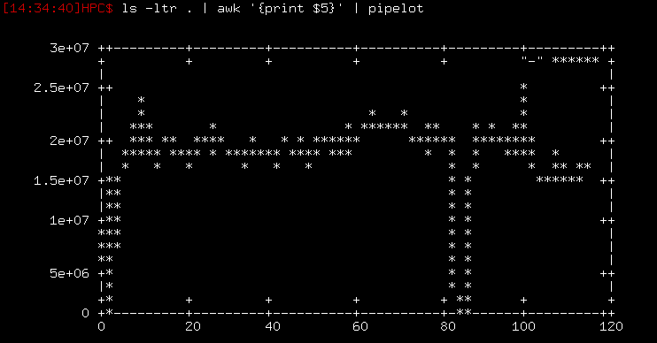

Pipelot
=======

Quick command-line plotting (using gnuplot). The name is a combination
of "pipe" and "plot", but I pronounce it like Lancelot, which sounds
like "pipe a lot", which describes what I do with data.

Installation
------------

Just stick it in your path.  Make sure you have gnuplot.

Usage
-----

Default settings (set at the top of the script) are to do line plots in
the terminal.  Suppose I want to see the trend in file size of some
data files (this is actually the exact problem that motivated me to
write this).  I just do:

    $ ls -ltr . | awk '{print $5}' | pipelot

and I get this:

To plot in an x11 window (instead of the ascii terminal) just add the
`-x` option.  Here are some other options:

 - `-f` to read from a file (instead of stdin)
 - `-o` to output to a file (extension must be the name of a valid
   gnuplot output type)
 - `-w` to set the "with" command for gnuplot
 - `-u` to set the gnuplot "using" command
 - `-e` to make your own gnuplot command from scratch
 - `-p` to set the plot command (plot, splot)

For example, to plot the file "file.dat" in an x11 window with dots:

    $ pipelot -x -f file.dat -w d

To plot the output of a command to a png image:

    $ <command> | pipelot -o myimage.png
